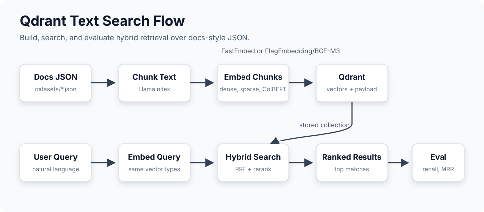

# Qdrant Text Search

A compact playground for building high-quality search over documentation with
Qdrant. The project takes docs-style JSON, chunks it, creates dense, sparse, and
ColBERT vectors, and compares hybrid retrieval quality with repeatable
evaluation scripts.

It is meant to make search experiments quick to repeat: swap an embedder, adjust
chunking, rebuild a collection, then run the same evaluation set to see what
actually improved.

## Flow



1. Load docs-style JSON from `datasets/`.
2. Chunk document text with LlamaIndex splitters and Hugging Face tokenizers.
3. Create dense, sparse, and ColBERT vectors with FastEmbed or FlagEmbedding.
4. Upload vectors and payloads into a Qdrant collection.
5. Embed the user query with the same vector types.
6. Run hybrid search in Qdrant and return ranked results.
7. Evaluate the same flow with recall, MRR, and latency metrics.

## Concepts

- **Chunking** controls how much context each vector represents; larger chunks keep
  more context, while smaller chunks can improve precise matches.
- **Dense vectors** capture semantic similarity, so related wording can match even when
  the exact query terms are missing.
- **Sparse vectors** capture lexical matches, which helps preserve keyword precision
  for names, API terms, settings, and error messages.
- **ColBERT vectors** keep token-level representations and compare them late in the
  search flow, giving stronger reranking than a single document vector alone.
- **RRF** merges the dense, sparse, and ColBERT result lists without needing their
  raw scores to be on the same scale.
- **Payload indexes** make filters such as `tags`, `page_url`, and `section_url`
  efficient during search.

## Setup

Install the Python dependencies:

```bash
pip install -r requirements.txt
```

Run Qdrant locally with persistent storage:

```bash
docker run --name qdrant -p 6333:6333 -p 6334:6334 \
  -e QDRANT__SERVICE__MAX_REQUEST_SIZE_MB=128 \
  -v "$(pwd)/qdrant_storage:/qdrant/storage:z" \
  qdrant/qdrant
```

The `qdrant_storage/` mount keeps collections across container restarts. The
128 MB request limit gives more room for large hybrid upserts, especially when
using ColBERT-style multi-vectors.

## Usage

1. Run the main search flow:

```bash
python qdrant_search.py
```

`qdrant_search.py` creates or reuses a collection, chunks the configured dataset,
embeds the chunks, uploads them to Qdrant, and runs a sample hybrid search.

2. Compare chunking strategies:

```bash
python scripts/compare_chunking.py
```

`compare_chunking.py` prints fixed, sentence, and semantic chunks for one sample
document.

3. Evaluate retrieval quality:

```bash
python scripts/evaluate_search.py
```

`evaluate_search.py` runs the eval queries and reports recall, MRR, and latency.

## Files

- `qdrant_search.py` contains `TextChunker` and `QdrantSearchManager`.
- `qdrant_embedder.py` contains FastEmbed and BGE-M3 document embedders.
- `qdrant_config.py` contains model ids, dataset configs, and vector/chunk config helpers.
- `scripts/compare_chunking.py` compares fixed, sentence, and semantic chunking.
- `scripts/evaluate_search.py` evaluates recall, MRR, and latency.
- `datasets/` contains the sample and generated dataset files.

## Libraries

- Qdrant stores vectors, payloads, indexes, and runs hybrid retrieval.
- FastEmbed provides the MiniLM dense model, BM25 sparse model, and ColBERT model.
- FlagEmbedding runs BGE-M3 for dense, sparse, and ColBERT-style vectors.
- Hugging Face provides model/tokenizer loading for chunking and embeddings.
- LlamaIndex provides sentence and semantic chunking utilities.

## Embedders

- `DocumentEmbedder` uses FastEmbed models for dense, sparse, and ColBERT vectors.
- `BGEM3DocumentEmbedder` uses FlagEmbedding with BGE-M3 for dense, sparse, and ColBERT vectors from one model.
- Vector dimensions are read from the active embedder and passed into the Qdrant collection config.

## Chunking

- `sentence` is the default strategy and preserves sentence boundaries with overlap.
- `fixed` splits by token count and is mostly useful for debugging.
- `semantic` uses embedding similarity to group nearby text.
- Chunk sizes live in `chunking_config()`, with separate defaults for MiniLM and BGE-M3.

## Dataset

Datasets are configured in `DATASET_CONFIGS`. Each entry points to a JSON file,
declares the expected entry count, and defines payload indexes for Qdrant. The
docs datasets currently index `page_url`, `section_url`, `tags`, and
`breadcrumbs`.

Example entry:

```json
{
  "page_title": "Collections and Points with Python client",
  "section_title": "Collection lifecycle",
  "page_url": "/documentation/concepts/collections-and-points/python/local-docker/",
  "section_url": "/documentation/concepts/collections-and-points/python/local-docker/#collection-lifecycle",
  "breadcrumbs": [
    "Documentation",
    "Concepts",
    "Collections and Points",
    "Python client",
    "Collection lifecycle"
  ],
  "chunk_text": "Collection lifecycle explains how collection design is usually modeled when Qdrant backs product search on local Docker. ...",
  "prev_section_text": "",
  "next_section_text": "Point identifiers and payloads explains how collection design is usually modeled when Qdrant backs product search on local Docker. ...",
  "tags": [
    "collections",
    "local-docker",
    "payload",
    "points",
    "product-search",
    "python",
    "vector-search"
  ]
}
```

## Evaluation

The evaluation script checks whether each query retrieves its expected
documentation URL in the top results. It reports recall, MRR, and latency for
the configured collection.

- **Recall@10** measures whether the expected URL or section anchor appears in
  the top 10 results. A score of `0.8` means the system finds the correct answer
  80% of the time.
- **MRR@10** measures how early the correct result appears. Rank 1 scores `1.0`,
  rank 2 scores `0.5`, and a miss in the top 10 scores `0`.
- **Latency P50/P95** measures response time. P50 is the median query latency,
  while P95 captures slower tail latency that affects user experience.

Example BGE-M3 run:

```text
Collection 'docs_search_bge_m3' ready (status=green, points=5400, segments=6).
Evaluation: queries=25, limit=10, candidate_limit=100, fusion=rrf, hnsw_ef=None

   rank=1   1585.1 ms  how to configure HNSW graph construction for better recall
   rank=1    498.9 ms  combine dense and sparse results with reciprocal rank fusion
   rank=6    368.1 ms  ColBERT token level vectors for reranking
   rank=1    225.6 ms  RAG context assembly and answer grounding

Summary: recall@10=1.000, mrr@10=0.910, p50=328.0 ms, p95=1507.7 ms
```

## Notes

- BGE-M3 creates much larger vectors than the MiniLM/FastEmbed setup, so keep upload batches small.
- The active collection, dataset, embedder, and chunking profile are selected in each script's `__main__` block.
- Use a new collection name when changing vector dimensions, otherwise Qdrant will reject incompatible uploads.
- The datasets are synthetic and were created with ChatGPT for search experiments.
- The large `qdrant_docs_100k` dataset uses Git LFS; install Git LFS and run
  `git lfs pull` after cloning if the file is not downloaded automatically.

## References

- Qdrant fundamentals: [Qdrant Essentials](https://qdrant.tech/course/essentials/)
- Dense embedding model: [all-MiniLM-L6-v2](https://huggingface.co/sentence-transformers/all-MiniLM-L6-v2)
- Semantic chunking: [LlamaIndex Semantic Double Merging Chunking](https://developers.llamaindex.ai/python/examples/node_parsers/semantic_double_merging_chunking/)
- BGE-M3 embedding library: [FlagEmbedding](https://github.com/flagopen/flagembedding)
